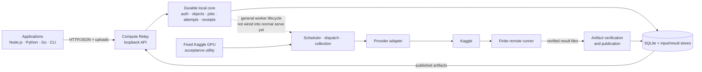

# Compute Relay

Compute Relay is a self-hosted control plane for **finite compute jobs**. Applications talk to a
local HTTP/JSON API instead of embedding provider SDKs or credentials. The runtime gives jobs a
durable identity, preserves attempts and recovery state, and verifies published result bytes.
Kaggle is the first provider adapter.

> **Pre-release status:** the normal `compute-relay serve` path is currently
> **local-admission-only**. It can authenticate applications, accept immutable inputs/jobs,
> record controls, and serve already published artifacts, but it does **not** start provider,
> scheduler, dispatch, or collection workers. A separate fixed Kaggle GPU acceptance utility has
> been live-qualified for private staging, Tesla T4 execution, restart/reconciliation, and result
> publication. That utility is provider qualification, not general server dispatch.
>
> Read [current status](docs/status.md) before depending on a capability.


## Architecture at a glance



The normal server stops at the durable local control-plane boundary; it does not follow the dashed
worker path yet. The separate fixed Kaggle acceptance utility composes that worker/provider path
for the bounded live-qualified experiment.

## What you can use today

| Goal | Available now? | Start here |
|---|---:|---|
| Build a private local runtime | Yes | [Getting started](docs/getting-started.md) |
| Create workspaces and scoped application tokens | Yes | [Local runtime](docs/local-runtime.md) |
| Package code and upload immutable objects | Yes | [Bundles and import](docs/packaging-and-import.md) |
| Validate and admit provider-neutral jobs | Yes | [Application CLI](docs/application-cli.md) |
| Recover an original receipt after an uncertain response | Yes | [Recovery](docs/recovery.md) |
| Download an already published artifact with end-to-end verification | Yes | [Artifact delivery](docs/artifact-delivery.md) |
| Run an arbitrary admitted job through normal `serve` | **No** | [Current status](docs/status.md) |
| Re-run the fixed Kaggle GPU qualification path | Maintainer/operator workflow | [Development docs](docs/development/README.md) |

A successful upload or `202 Accepted` job receipt is **not** evidence that remote compute started.

## Quick start

Requirements: Git plus the Go version pinned in [`go.mod`](go.mod) (currently Go 1.27.1).

```sh
git clone https://github.com/vankhaivn/compute-relay.git
cd compute-relay
go build -trimpath -o compute-relay ./cmd/compute-relay
./compute-relay help
```

For the first complete walkthrough — initialize a runtime, create a workspace/token, apply an
admission profile, start the server, package code, upload it, and admit a job — follow
**[Getting started](docs/getting-started.md)**.

For repeat operation after the first setup, use the **[Operator runbook](docs/runbook.md)**.

## Documentation

The top level of [`docs/`](docs/README.md) is intentionally for people **using or operating**
Compute Relay:

- [Getting started](docs/getting-started.md) — one fresh-clone walkthrough.
- [Operator runbook](docs/runbook.md) — task-oriented commands for an existing installation.
- [Local runtime](docs/local-runtime.md) — installation, workspace/token administration, serving.
- [Application CLI](docs/application-cli.md) — profiles, uploads, validation, admission and controls.
- [Bundles and import](docs/packaging-and-import.md) — safe source packaging.
- [Artifact delivery](docs/artifact-delivery.md) — verified reads/downloads of published results.
- [Recovery](docs/recovery.md) — what to do after uncertain responses or state.
- [Compatibility](docs/compatibility.md) — pinned environments and host/filesystem constraints.
- [Current status](docs/status.md) — exact implementation and support boundary.

If you are changing the product, provider adapter, architecture, tests, or release process, start
with **[Development documentation](docs/development/README.md)**. Architecture, ADRs, research,
provider qualification, validation procedures, requirements, and implementation planning live
there so they do not obscure the normal usage path.

## Operating model

Compute Relay is local and operator-controlled. Provider credentials stay behind provider
configuration and are never application tokens. There is no automatic provider/account/CPU/paid
fallback, and ambiguous submission is recovered by observing the original attempt rather than
silently resubmitting it.

Normal `serve` listens only on an explicit loopback address. It is not a hosted service or public
multi-tenant gateway. Keep runtime state, tokens, private inputs, raw provider responses and signed
artifact URLs outside the source checkout.

## Project status

There is no public release yet. General provider registration/worker lifecycle, remaining
log/cleanup surfaces, strict runtime configuration, doctor/client examples, installation packaging,
and release hardening remain. See [current status](docs/status.md) for what exists now.

Compute Relay is licensed under [Apache-2.0](LICENSE). Provider services, uploaded data, models and
third-party dependencies retain their own terms and licenses.
